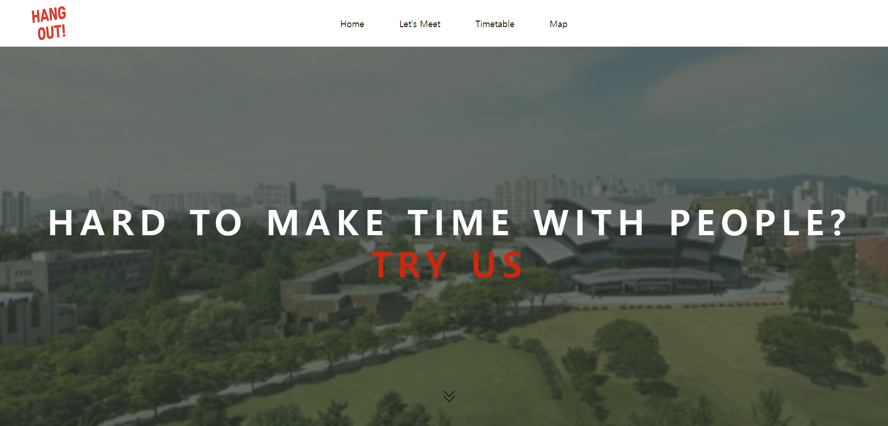
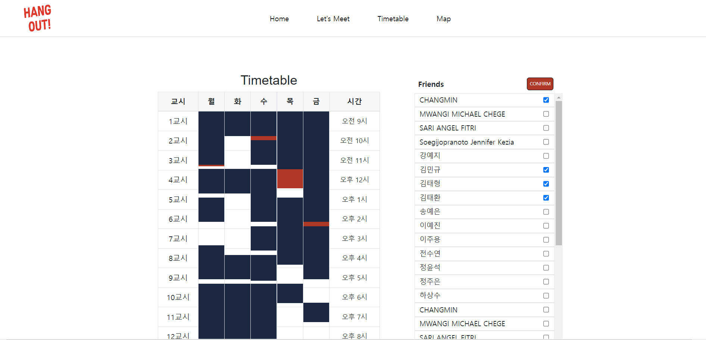
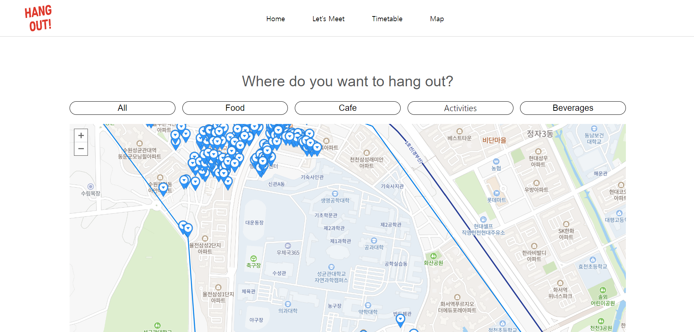

# Hangout
This is an Open Source Project that aims at making it convenient for friends to match their schedule and discover new places to hang out near SKKU.

We noticed that it was visually difficult for a bunch of friends to conveniently compare their schedules and meet at a specific time and location. Moreover, friends tend to go to the same places and have trouble in discovering new places to hang out. Our web page solves both of these issues as we use the timetable function of Everytime, wide-used college mobile, to display and compare the time available with the friend you want and we use the Naver Map API to help you discover new places around SKKU.

## Example
1. main page  

2. Time table 

3. Map

4. Demo video  
[youtube](https://www.youtube.com/watch?v=IFPoISu1zbA)  

## 5. Works

- Kim Dong Hyun: Frontend developer / Web designer

> 1. Construct out design of Web pages
> 2. Collect Naver map api data
> 3. Design the thumbnail

- Park Jin suk: Product manager

> 1. Plan web service
> 2. Apply Naver map api
> 3. Manage/Control Git repository

-Park Jongeun: Back-End

> 1.  Construct timetable and do Crawling
> 2.  Maintain sever
> 3.  Mangage Dependencies

## 6. [License]
Licensed under MIT.

Code of Conduct
As a contributor, you can help us keep our application open and inclusive.

Please read and follow our Code of Conduct.

## 우수프로젝트 시상 프로그램에 지원합니다
